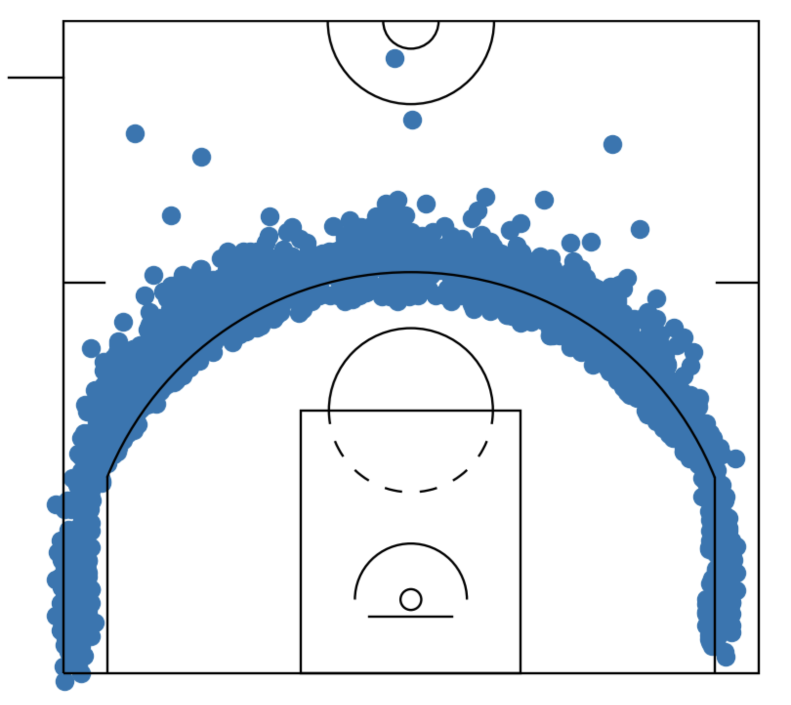

# MrCateringRATATATATA

This project aims to analyze basketball shots using the NBA shots dataset from 2001 to the present. It focuses on mentions of the player José Calderón and his 3-point shots.

## Calderón Overview

Check out this video of Calderón's baskets against the Lakers:

[](https://www.youtube.com/watch?v=BdxfhRCU_Qc)


## Links
- Kaggle: [NBA Shots Dataset](https://www.kaggle.com/datasets/techbaron13/nba-shots-dataset-2001-present)

## Installation

1. **Download the data**
   Download the NBA shots dataset and ensure the folder `nba` is placed inside the `data` directory. You can download the dataset from [Kaggle: NBA Shots Dataset](https://www.kaggle.com/datasets/techbaron13/nba-shots-dataset-2001-present).

   After downloading, the directory structure should look like this:
   ```
   data/
   └── nba/
       ├── file1.csv
       ├── file2.csv
       └── ...
   ```

2. **Create a virtual environment**:
   ```bash
   python3 -m venv MrCateringRATATATATA
   ```

3. **Activate the virtual environment**:
   ```bash
   source MrCateringRATATATATA/bin/activate
   ```

4. **Install Dependencies**
    Install the required dependencies from the `requirements.txt` file:
    ```bash
    pip install -r requirements.txt
    ```

    This project utilizes the `mplbasketball` library for visualizing basketball shots. You can find more information about this library and its usage on its [GitHub page](https://github.com/mlsedigital/mplbasketball).


5. **Update the requirements.txt file**
    Freeze the current dependencies and update the `requirements.txt` file:
    ```bash
    pip freeze > requirements.txt
    ```

6. **Prepare the data**
    Run the script to search for mentions of 'José Calderón' and filter his 3-point shots:
    ```bash
    python utils/prepare_data.py
    ```

    The results will be saved in a new CSV file named `three_pointer_shots.csv` in the `data` directory.

## Analyze the data
7. **Open the Jupyter Notebook**
    To analyze the data, open the Jupyter Notebook file `jose_manuel_calderon_analysis.ipynb`:
    ```bash
    jupyter notebook jose_manuel_calderon_analysis.ipynb
    ```

    This notebook contains various analyses and visualizations of José Calderón's 3-point shots.

    ### Three-point shots of José Calderón

    Here are some representations of José Manuel Calderón's three-point shots found in the `images` folder:

    
    
